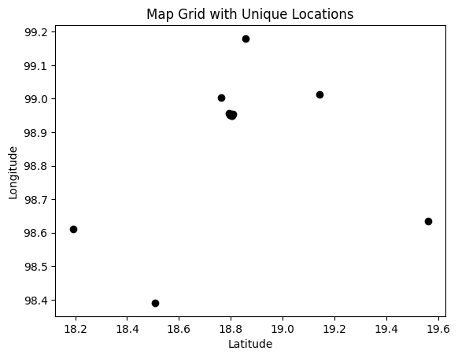
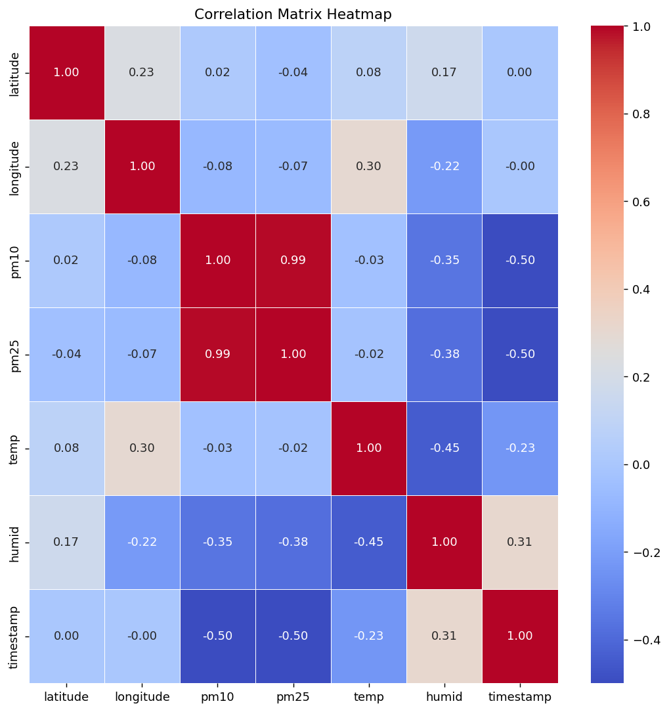
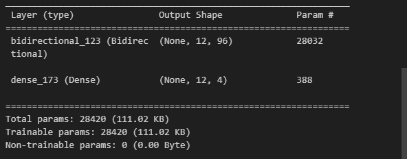
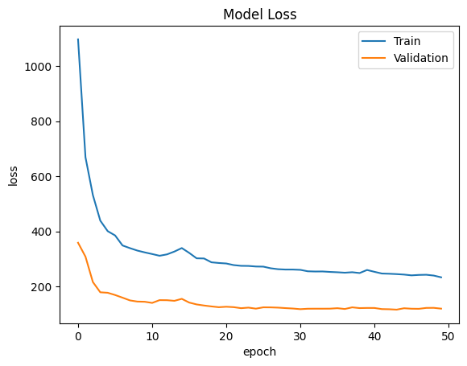
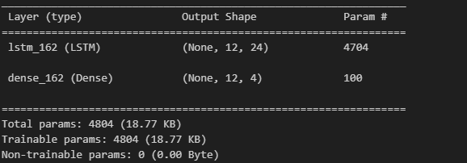
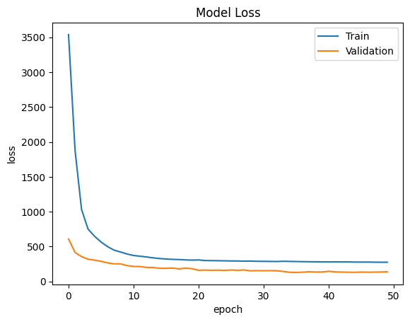
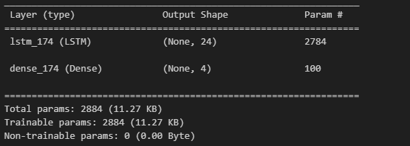
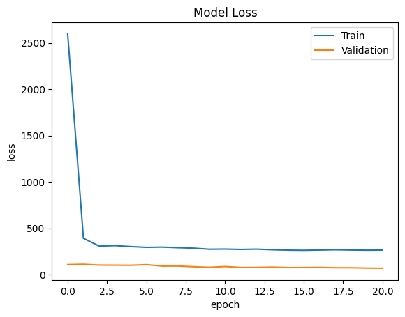

# spatial-lstm
- `RE1.1`             ใช้ train
- `RE1.2`             ใช้ test
- `model`             เก็บจาก train (model-ตัวที่เราทำ compair-lstm)
- `error`             ผลtest model
- `backup_data`       สำรอง raw กับ clear(sum zero กับลบจุดผิด)
- `map_all`           เซ็นเซอร์ทั้งหมด
- `merged_data`       ข้อมูลของทุกfileที่ใช้ trian
- `research_code`     code

`จุดประสงค์`
  - เพื่อหาแนวทางการศึกษาที่ ช่วยในการพยากรณ์ คุณภาพอากาศใน spatial temporal ที่มีประสิทธิภาพที่ดี

`ที่มาของข้อมูล`
  - CMU CCDC: Climate Change Data Center of Chiangmai University [ลิงค์](https://www.cmuccdc.org/download/)

`พื้นที่ที่ทำการศึกษา`
  - ในเชียงใหม่ [จุดในแผนที่](map_sensor.html)
     

`วิธีการ`
  - เลือกใช้ model คือ bidirectional lstm และ lstm 
    - bidirectional lstm ที่แต่ละ cell ใส่ data ของแต่ละsensor 
    - lstm ที่แต่ละ cell ใส่ data ของแต่ละsensor
    - lstmแบบปกติ ที่แต่ละ cell ใส่ data ของแต่ละ time step ของsensor

  - train data 2023-01-30 00:00:00 ถึง 2024-01-30 00:00:00 (365 days 00:00:00)
  - test data 2024-01-30 01:00:00 ถึง 2024-02-11 09:00:00 (12 days 08:00:00)

`ผลการศึกษา`
  - corr after data preprocessing
    

  - bidirectional lstm (spatial temporal) 
    
    
    [error](error/error_metrics_1.txt)

  - lstm (spatial temporal) 
    
    
    [error](error/error_metrics_1point.txt)

  - lstm (temporal)(sensor 2)
       
    
    [error](error/error_metrics_2.txt)
    
`ref`
  - `ตัวอย่างที่เอามาใช้`
    - https://www.sciencedirect.com/science/article/pii/S1574954122001376?casa_token=Sgd5WcZLtu8AAAAA:4h_h0x_vQhmVDccgCSlWDt6MSnqInCHLsliH4iesdLJczCrK5GqpXfO4u2I15gOTiPKerYQCNtc

  - `ML ผลสำรวจที่เอามาใช้ในการทำนาย ช่วง2011-2021 155 ฉบับ`
    - https://link.springer.com/article/10.1007/s10462-023-10424-4

  - `ศึกษา Air Quality in California`
    - https://www.hindawi.com/journals/complexity/2020/8049504/

  - `Health risk`
    - https://link.springer.com/article/10.1007/s11869-022-01231-x

  - `compare LSTM and BiLSTM in Forecasting Time Series`
    - https://ieeexplore.ieee.org/abstract/document/8614252

  - `Deep Learning With TensorFlow`
    - https://journals.sagepub.com/doi/full/10.3102/1076998619872761

  - `LSTM Cells and Network Architectures `
    - https://web.p.ebscohost.com/ehost/pdfviewer/pdfviewer?vid=0&sid=25ff47fe-9c80-4b7b-8718-0478cb216275%40redis
   
  - `เขตภูมิอากาศ ในไทย`
    - https://www.sciencedirect.com/science/article/pii/S0960148101000052#FIG6

  - `การทำข้อมูล`
    - https://dl.acm.org/doi/10.1145/2379776.2379788
